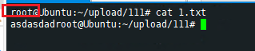

# 介绍
本项目是为了解决重复的将本地编写的文件上传到远程服务器上

# 使用说明

本程序只在 Windows 上进行了测试。

将压缩包解压以后运行 launch.bat 脚本，后面需要接一个参数，表示指定的工作空间。

# 工作目录

工作目录是在 conf/config.yml 中配置的。

目前程序中有3个工作目录，分别是：
- test
- datax
- flink

用户可以无限制的添加工作空间，只要在启动的时候指定一个工作目录即可。

注意：config.yml 中的 uploadPath 最后的分隔符必须带上，因为是远程的不能区别Windows和Linux

# 命令介绍
这里有三个命令，分别是：
- 开始命令：也就是在工作空间中指定的 startCmd 命令。是程序启动的时候执行的命令。
- 前置命令：也就是在工作空间中指定的 frontCmd 命令。是文件上传到远程服务器之前执行的命令。
- 后置命令：也就是在工作空间中指定的 backCmd 命令。是文件上传到远程服务器之后执行的命令。

# 实操
此项目演示了将文件上传到远程服务器的的 zs 用户的 `/home/zs/upload/` 目录下，由于我这里的用户并非是 root 用户，所以在配置文件中添加了`开始命令`切换到 root 用户下。然后将文件同步到 `/home/zs/upload/` 下。

config.yml:
```yml
workspace:
  test:
    monitorFile: C:\111
    ip: localhost
    port: 3316
    user: zs
    password: 111
    uploadPath: /home/zs/upload/
    startCmd:
      - "sudo su"
      - "cd /root"
      - "pwd"
    frontCmd:
#      - "rm -f /root/1.txt"
    backCmd:
     - "rsync -avz /home/zs/11 /root"
  datax:
  flink:
```

在命令行下运行 `launch.bat test`


然后就会自动同步 `C:\111` 路径下的所有文件。


现在在 `C:\111` 下创建 `1.txt` 文件，输入内容然后保存，就会自动同步到Linux的指定目录下。


并且`root` 中也同步过来了。




# 目前规划

- [x] 配置文件
- [x] 工作空间
- [x] 开始命令，前置命令，后置命令
- [x] 文件夹监控上传
- [ ] 目前仅支持文件上传到 Linux 下


# 注意
本程序使用 Java11 开发的，理论上 Java8 也可以运行。